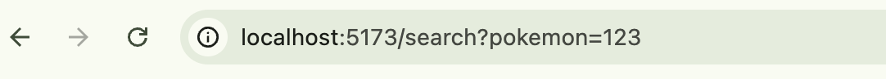
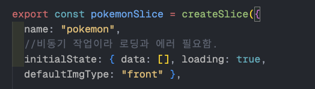

# 포켓몬 도감 만들기 미니프로젝트

## 📖 포켓몬 도감 (Pokédex)

리액트와 최신 프론트엔드 기술 스택을 활용하여 제작한 포켓몬 도감 애플리케이션입니다.
포켓몬의 이름, 이미지, 설명을 불러오고 검색 및 찜 기능을 제공합니다.

<br/>
<br/>

---

## 1. 검색 페이지

<br/>

### 1-1. 검색창 구현

```jsx
<div className="flex items-center">
  <input
    type="text"
    placeholder="포켓몬검색"
    className="border-b border-[darkgrey] px-2 w-32 "
  />
  <FaMagnifyingGlass />
</div>
```

- 아이콘은 리액트 라이브러리 사용

```bash
  npm install react-icons --save
```

<br/>

### 1-2. 검색어 구현

> "search?pokemon=파이리"

- 사용자가 입력한 검색어는 검색창에서 어떻게 링크 해야될까?
- 위 예제같이 사용자가 입력한 검색어가 `?pokemon=검색어 `에 담겨져셔 정보를 보내게 될 것이다.
- `쿼리스트링으로` 구현 함 !

#### navigate로 검색어 이동을 바로 시켜버린다.

- `navigate로` 검색어를 쿼리스트링으로 바로 이동
- 검색어창이 변화된다면 -> `onChange로` 된다면, 타겟값을 `navigation()` 으로 이동

```jsx
  //검색어 입력하면 바로 url이동 하도록
  onChange={(e) => navigate(`/search?pokemon=${e.target.value}`)}
```

- `/search?pokemon=` 에 이벤트 값이 들어온다.

<br/>

### 1-3. 검색어 받아와서 처리하기

> useSearchParams() 검색어에 타이핑 된 값 가져오기

- 이제 Search.jsx페이지에서 navigater에서 받은 쿼리값을 처리하자
- `useSearchParams()`는 배열타입으로 들어온다.
- 우리는 이 배열에서 검색어 키워드인 pokemone에 들어온 값을 찾으면 된다.



```jsx
const [searchParams] = useSearchParams();
const pokemon = searchParams.get("pokemon"); //배열에서 검색어변수명인 pokemon에서 값 찾아오기.
```

<br/>

#### **정규표현식으로 검색어 변환**

- 우리는 정규표현식을 통해서 검색어 매칭 편하게 받는 라이브러리를 설치 할 것이다.
- 대소문자 구분안하고, 자음모음 구분없이 바로 매칭하여 검색 결과 필터링 되도록 설정하는 것임 !
- 사용시 getRegExp() 를 통해 정규식으로 바꿔

```bash
npm i korean-regexp
```

<br/>

### 1-4. 검색어와 일치하는 데이터값 불러오는 selector만들기

- 검색어와 일치하는 데이터를 RTK에서 설정한 useSelector에서 꺼내서 로직을 짜야함.
- 모듈화 시키기 위해서, reg에서 받아온 값과 RTK에 저장된 데이터 찾는 selector를 만들자.

  

```jsx
export const selectPokemonByRegExp = (reg) =>
  createSelector(
    (state) => state.pokemon.data,
    //filter를 돌려서 일치하는 값을 뱉어내기 match로
    // 여기서 pokemon = state.pokemon.data
    (pokemon) => pokemon.filter((el) => el.name.match(reg))
  );
```

1. `createSelector` 로 상태 꺼내오는 함수를 만들 것
2. `(state) => state.pokemon.data,` 는 슬라이스에 세팅되어 있는,pokemon 데이터의 배열을 의미함
3. 여기서 `data의` 들어있는 배열을 통째로 `pokemon` 이라고 설정함.

<br/>

### 1-5. selector로 상태값 꺼내어서 map으로 돌리기

```jsx
const pokemon = useSelector(selectPokemonByRegExp(reg));

return ({
  pokemon.map((el) => <Card key={el.id} pokemonData={el}></Card>);
})
```

1. `useSelector` 로 검색어와 일치하여 필터링 된 배열값을 가지고 왔다.
2. 이제 map으로 돌려서 랜더링 해주기.
